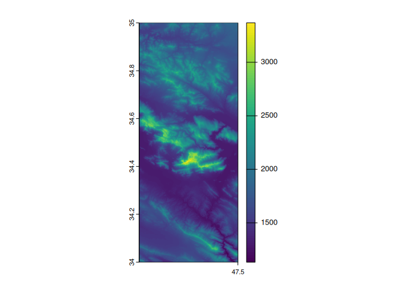

# getsat: Retrieving Commonly Used Satellite Data

<!-- badges: start -->
<!-- badges: end -->

`getsat` is an R package designed to simplify access to commonly used
satellite data on environmental variables. It provides an easy way to
retrieve, process, and integrate satellite-based data from sources such
as: - Copernicus Atmosphere Monitoring Service - Copernicus Climate Data
Store - Microsoft Planetary Computer

## Installation

You can install the development version of getsat from
[GitHub](https://github.com/) using the
[pak](https://CRAN.R-project.org/package=pak) package:

``` r
# Install pak if not already installed
install.packages("pak")

# Install getsat from GitHub
pak::pak("jalilian/getsat")
```

## Example: Retrieve Elevation Data

The following example shows how to retrieve elevation data from the
Copernicus Digital Elevation Model (DEM). You can specify either a
bounding box for an area of interest or provide specific coordinates.

``` r
library("getsat")

# Retrieve elevation data for a bounding box (longitude/latitude)
elev1 <- get_dem(c(47, 34, 47.5, 35), res=90)
#>   |                                                                              |                                                                      |   0%  |                                                                              |===================================                                   |  50%  |                                                                              |======================================================================| 100%
# plot retrived elevation data
terra::plot(elev1)
```



``` r

# Retrieve elevation for specific coordinate points
coords <- cbind(runif(n = 100, min = 47, max = 47.5), 
                runif(n = 100, min = 34, max = 35))
elev2 <- get_dem(coords, res = 90)
#>   |                                                                              |                                                                      |   0%  |                                                                              |============                                                          |  17%  |                                                                              |=======================                                               |  33%  |                                                                              |===================================                                   |  50%  |                                                                              |===============================================                       |  67%  |                                                                              |==========================================================            |  83%  |                                                                              |======================================================================| 100%
# Print retrieved elevation values
head(elev2)
#>         X1       X2 elevation
#> 1 47.35133 34.98227  1757.569
#> 2 47.14179 34.19935  1975.915
#> 3 47.07255 34.89965  2099.728
#> 4 47.00149 34.62083  1596.169
#> 5 47.32481 34.82007  2125.146
#> 6 47.47290 34.94845  1812.318
```
