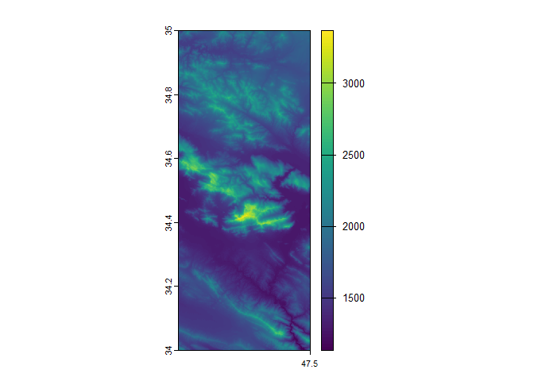
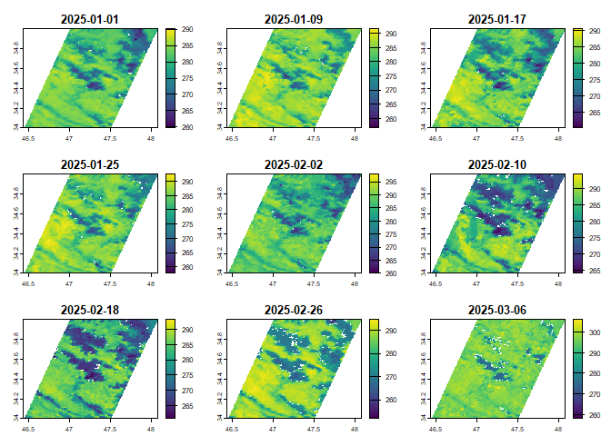

# getsat: Retrieving Commonly Used Satellite Data

<!-- badges: start -->
<!-- badges: end -->

`getsat` is an R package designed to simplify access to commonly used
satellite data on environmental variables. It provides an easy way to
retrieve, process, and integrate satellite-based data from sources such
as:

- [Copernicus Climate Data Store](https://cds.climate.copernicus.eu)
- [Copernicus Atmosphere Data
  Store](https://ads.atmosphere.copernicus.eu)
- [Microsoft Planetary
  Computer](https://planetarycomputer.microsoft.com)

Please note that users must acknowledge the original data sources
appropriately. Any use of data from these platforms requires clear and
visible attribution, including proper citation and referencing of the
datasets, as specified by their licenses and terms of use.

Development of this package was supported by the Lancaster Ecology and
Epidemiology Group (LEEG) and funded by Biotechnology and Biological
Sciences Research Council (BB/Y514238/1) and the Wellcome Trust
(220870/Z/20/Z).

## Installation

To install the development version of `getsat` from
[GitHub](https://github.com/), use the
[remotes](https://CRAN.R-project.org/package=remotes) package:

``` r
# Install pak if not already installed
install.packages("remotes")

# Install getsat from GitHub
remotes::install_github("jalilian/getsat")
```

## Example 1: Retrieve elevation data

The following example shows how to retrieve elevation data from the
[Copernicus Digital Elevation Model
(DEM)](https://doi.org/10.5069/G9028PQB). You can specify a bounding box
for an area of interest or provide specific coordinates.

``` r
library("getsat")

# Retrieve elevation data for a bounding box (longitude/latitude)
elev1 <- get_dem(c(47, 34, 47.5, 35), res=90)
#> For citation and terms of use, see
#> <https://dataspace.copernicus.eu/explore-data/data-collections/copernicus-contributing-missions/collections-description/COP-DEM>
#>   |                                                                              |                                                                      |   0%  |                                                                              |===================================                                   |  50%  |                                                                              |======================================================================| 100%
# plot retrived elevation data
terra::plot(elev1)
```



``` r

# Retrieve elevation for specific coordinate points
coords <- cbind(runif(n = 100, min = 47, max = 47.5), 
                runif(n = 100, min = 34, max = 35))
elev2 <- get_dem(coords, res = 90)
#> For citation and terms of use, see
#> <https://dataspace.copernicus.eu/explore-data/data-collections/copernicus-contributing-missions/collections-description/COP-DEM>
#>   |                                                                              |                                                                      |   0%  |                                                                              |============                                                          |  17%  |                                                                              |=======================                                               |  33%  |                                                                              |===================================                                   |  50%  |                                                                              |===============================================                       |  67%  |                                                                              |==========================================================            |  83%  |                                                                              |======================================================================| 100%
# Print retrieved elevation values
head(elev2)
#>         X1       X2 elevation
#> 1 47.37065 34.97248  1913.149
#> 2 47.05973 34.59647  2681.496
#> 3 47.40024 34.01966  1993.446
#> 4 47.00512 34.47211  1305.152
#> 5 47.01818 34.16804  1521.923
#> 6 47.24421 34.88025  1776.818
```

## Example 2: Retrieve temprature from MODIS

This example shows how to retrieve 8-day daytime temperature data from
the [Moderate Resolution Imaging Spectroradiometer
(MODIS)](https://planetarycomputer.microsoft.com/dataset/group/modis).
Make sure to properly cite MODIS data following [NASA’s
guidelines](https://modaps.modaps.eosdis.nasa.gov/services/faq/LAADS_Data-Use_Citation_Policies.pdf).
You can specify a bounding box “c(xmin, ymin, xmax, ymax)” or
coordinates (longitude, latitude), and provide the desired time period
in the format “YYYY-MM-DD/YYYY-MM-DD”.

``` r
# Retrieve temperature data for a bounding box (longitude/latitude) and specific time period
temp <- get_modis(c(47, 34, 47.5, 35), var = "LST_Day_1KM",
                  datetime = "2025-01-01/2025-03-09")
#> See 'Data Use Guidelines for NASA Terra and Aqua MODIS, Suomi NPP, and other Collections.'
#> - Available at <https://modaps.modaps.eosdis.nasa.gov/services/faq/LAADS_Data-Use_Citation_Policies.pdf>
#> LST_Day_1KM has been found in collection(s):
#>                id                                                  title
#> 55 modis-21A2-061 MODIS Land Surface Temperature/3-Band Emissivity 8-Day
#> modis-21A2-061 (MODIS Land Surface Temperature/3-Band Emissivity 8-Day) is sellected.
#> Use argument 'collection' if you need:
# plot retrived temperature data
terra::plot(temp)
```


